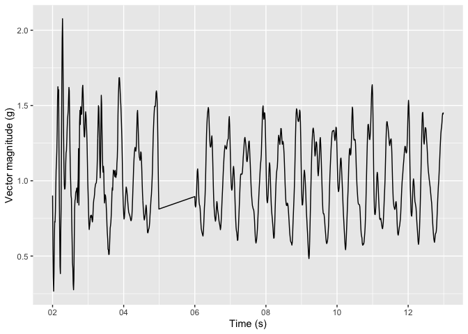
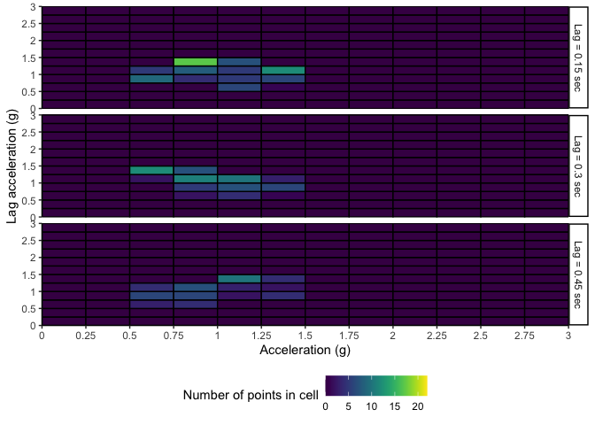

<!-- README.md is generated from README.Rmd. Please edit that file -->

# accelPrint

<!-- badges: start -->

[](https://github.com/lilykoff/accelPrint/actions/workflows/R-CMD-check.yaml)
<!-- badges: end -->

The goal of accelPrint is to do fingerprinting for acceleration and
walking.

## Installation

You can install the development version of accelPrint from
[GitHub](https://github.com/) with:

``` r
# install.packages("pak")
pak::pak("lilykoff/accelPrint")
```

## Example

This is a basic example which shows you how to use the package

### Get walking bouts from raw accelerometry data

``` r
library(accelPrint)
library(ggplot2)
library(dplyr)
#> 
#> Attaching package: 'dplyr'
#> The following objects are masked from 'package:stats':
#> 
#>     filter, lag
#> The following objects are masked from 'package:base':
#> 
#>     intersect, setdiff, setequal, union
# load example data 
data(raw_accel)
# run the get walking function
walking_bouts = accelPrint::get_walking(raw_accel, parallel = TRUE)
#> Sample rate not provided. Inferred sample rate: 100 Hz
#> Parallel processing is enabled, but cores are not specified. Using all available cores (8)
#> ADEPT completed
head(walking_bouts) 
#> # A tibble: 6 × 6
#>   time                     x      y      z second              bout_seconds
#>   <dttm>               <dbl>  <dbl>  <dbl> <dttm>                     <int>
#> 1 2000-01-01 12:04:02 -0.711 -0.555  0.016 2000-01-01 12:04:02           20
#> 2 2000-01-01 12:04:02 -0.387 -0.387  0.152 2000-01-01 12:04:02           20
#> 3 2000-01-01 12:04:02 -0.141 -0.258  0.207 2000-01-01 12:04:02           20
#> 4 2000-01-01 12:04:02 -0.145 -0.148  0.168 2000-01-01 12:04:02           20
#> 5 2000-01-01 12:04:02 -0.379 -0.012  0.051 2000-01-01 12:04:02           20
#> 6 2000-01-01 12:04:02 -0.594  0.121 -0.09  2000-01-01 12:04:02           20

walking_bouts %>% 
  slice(1:(10 * 100)) %>% # take first 10 s 
  mutate(vm = sqrt(x^2 + y^2 + z^2)) %>% # compute vector magnitude
  ggplot(aes(x = time, y = vm)) + 
  geom_line() + 
  scale_x_datetime(date_labels = "%S") + 
  labs(x = "Time (s)", y = "Vector magnitude (g)")
```



### Get fingerprint predictors from walking bouts

``` r
# run the get grid cells function on the walking bouts
# specify lags of 0.15, 0.30, 0.45 seconds and grid cell size of 0.25g 
fingerprint_predictors = compute_grid_cells(walking_bouts, 
                                            lags = c(0.15, 0.30, 0.45), 
                                            cell_size = 0.25,
                                            max_vm = 3)
#> Sample rate not provided. Inferred sample rate: 100 Hz

head(fingerprint_predictors) 
#> # A tibble: 6 × 433
#>   second              `[0,0.25]_[0,0.25]_15` `[0,0.25]_(0.25,0.5]_15`
#>   <dttm>                               <int>                    <int>
#> 1 2000-01-01 12:04:02                      0                        0
#> 2 2000-01-01 12:04:03                      0                        0
#> 3 2000-01-01 12:04:04                      0                        0
#> 4 2000-01-01 12:04:06                      0                        0
#> 5 2000-01-01 12:04:07                      0                        0
#> 6 2000-01-01 12:04:08                      0                        0
#> # ℹ 430 more variables: `[0,0.25]_(0.5,0.75]_15` <int>,
#> #   `[0,0.25]_(0.75,1]_15` <int>, `[0,0.25]_(1,1.25]_15` <int>,
#> #   `[0,0.25]_(1.25,1.5]_15` <int>, `[0,0.25]_(1.5,1.75]_15` <int>,
#> #   `[0,0.25]_(1.75,2]_15` <int>, `[0,0.25]_(2,2.25]_15` <int>,
#> #   `[0,0.25]_(2.25,2.5]_15` <int>, `[0,0.25]_(2.5,2.75]_15` <int>,
#> #   `[0,0.25]_(2.75,3]_15` <int>, `(0.25,0.5]_[0,0.25]_15` <int>,
#> #   `(0.25,0.5]_(0.25,0.5]_15` <int>, `(0.25,0.5]_(0.5,0.75]_15` <int>, …
```

``` r
# plot 
fingerprint_predictors %>% 
  tidyr::pivot_longer(cols = -second) %>% 
  tidyr::separate_wider_delim(name, delim = "_", names = c("vm", "lag_vm", "lag")) %>% 
  mutate(lag = paste0("Lag = ", as.numeric(lag)/100, " sec")) %>% 
  mutate(vm = factor(vm, levels = c("[0,0.25]", "(0.25,0.5]", 
                                   "(0.5,0.75]", "(0.75,1]", "(1,1.25]", "(1.25,1.5]", 
                                   "(1.5,1.75]", "(1.75,2]", "(2,2.25]", "(2.25,2.5]", 
                                   "(2.5,2.75]", "(2.75,3]")),
         lag_vm = factor(lag_vm, levels = c("[0,0.25]", "(0.25,0.5]",
                                            "(0.5,0.75]", "(0.75,1]", "(1,1.25]",
                                            "(1.25,1.5]", "(1.5,1.75]", "(1.75,2]",
                                            "(2,2.25]", "(2.25,2.5]", "(2.5,2.75]",
                                            "(2.75,3]"))) %>% 
  mutate(across(contains("vm"), as.numeric)) %>% 
  ggplot() + 
  geom_rect(aes(xmin = vm - 1, xmax = vm, ymin = lag_vm - 1, ymax = lag_vm, fill = value), color = "black") +
  theme_classic() +
  scale_x_continuous(
    name = "Acceleration (g)",
    breaks = seq(0, 12, by = 1),
    labels = c("0", "0.25", "0.5", "0.75", "1", "1.25", "1.5", "1.75", "2", "2.25", "2.5", "2.75", "3"),
    expand = c(0, 0)
  ) + 
  scale_y_continuous(
    name = "Lag acceleration (g)",
    breaks = seq(0, 12, by = 2),
    labels = c("0", "0.5", "1", "1.5", "2", "2.5", "3"),
    expand = c(0, 0)
  ) + 
  viridis::scale_fill_viridis(name = "Number of points in cell") + 
  facet_grid(lag ~ .) +
  theme(legend.position = "bottom")
```


